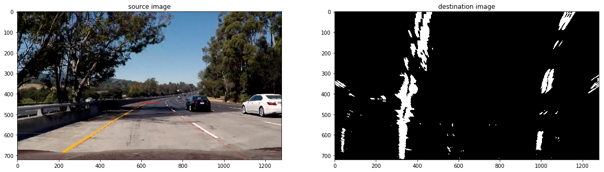

# **Advanced Lane Finding Project**

The goals / steps of this project are the following:

* Compute the camera calibration matrix and distortion coefficients given a set of chessboard images.
* Apply a distortion correction to raw images.
* Use color transforms, gradients, etc., to create a thresholded binary image.
* Apply a perspective transform to rectify binary image ("birds-eye view").
* Detect lane pixels and fit to find the lane boundary.
* Determine the curvature of the lane and vehicle position with respect to center.
* Warp the detected lane boundaries back onto the original image.
* Output visual display of the lane boundaries and numerical estimation of lane curvature and vehicle position.

[//]: # (Image References)

[video1]: ./project_video.mp4 "Video"

## [Rubric](https://review.udacity.com/#!/rubrics/571/view) Points

Here I will consider the rubric points individually and describe how I addressed each point in my implementation.  

---

### Writeup / README

#### 1. Provide a Writeup / README that includes all the rubric points and how you addressed each one.  You can submit your writeup as markdown or pdf.  [Here](https://github.com/udacity/CarND-Advanced-Lane-Lines/blob/master/writeup_template.md) is a template writeup for this project you can use as a guide and a starting point.  

You're reading it!

### Camera Calibration

#### 1. Briefly state how you computed the camera matrix and distortion coefficients. Provide an example of a distortion corrected calibration image.

The code for this step is contained in the third code cell of the IPython notebook located in "./P4.ipynb".

I start by preparing "object points", which will be the (x, y, z) coordinates of the chessboard corners in the world. Here I am assuming the chessboard is fixed on the (x, y) plane at z=0, such that the object points are the same for each calibration image.  Thus, `objp` is just a replicated array of coordinates, and `objpoints` will be appended with a copy of it every time I successfully detect all chessboard corners in a test image.  `imgpoints` will be appended with the (x, y) pixel position of each of the corners in the image plane with each successful chessboard detection.  

I then used the output `objpoints` and `imgpoints` to compute the camera calibration and distortion coefficients using the `cv2.calibrateCamera()` function.  I applied this distortion correction to the test image using the `cv2.undistort()` function and obtained this result: 


### Pipeline (single images)

#### 1. Provide an example of a distortion-corrected image.

To demonstrate this step, I will describe how I apply the distortion correction to one of the test images like this one:


#### 2. Describe how (and identify where in your code) you used color transforms, gradients or other methods to create a thresholded binary image.  Provide an example of a binary image result.

I used a combination of color and gradient thresholds to generate a binary image (thresholding steps at section Binary image [`./P4.ipynb`](./P4.ipynb)).  Here's an example of my output for this step.


As a final result I used three combinations. 
1. grayscale gradient x (red on bellow image)
2. s channel thresholded (green on bellow image)
3. H channel thresholded (blue on bellow image)

I used all points of the grayscale gradient and the points of S that were not in H.

```python
combined = np.zeros_like(s_tresh)
combined[((s_tresh == 1) & (s_tresh != h_binary)) | ((grad_x == 1))] = 1
```


I noticed that the grayscale grad was the one who best drew the end of the line (top)


#### 3. Describe how (and identify where in your code) you performed a perspective transform and provide an example of a transformed image.

The code for my perspective transformation starts in the ** Perspective transform ** section.
There are four functions involved in the transformation process, they are:

1. `extract_points_mask`: return the points that will be the src in the transformation
2. `find_y_line`: This method was created in order to make it easier to increase or decrease y from the top, since the line has already been defined in the extract_points_mask method. Without this method it would be harder every time to change the source points.
3. `draw_lines`: draws line in the images
4. `warp`: changes the perspective

The first thing is to extract the points to source by calling the `extract_points_mask` method.
```python
x_bl, x_tl, x_tr, x_br, y_top = extract_points_mask(img)
```

Then I make an adjustment before creating the source points, decreasing the top area
```python
# points that will be used in source points to transform
offset = -15
new_left_x = x_tl + offset
new_left_y = find_y_line(x_bl, x_tl, y_top, rows, new_left_x)
new_right_x = x_tr - offset
new_right_y = find_y_line(x_br, x_tr, y_top, rows, new_right_x)

src = np.float32([
    [x_bl, rows], 
    [new_left_x, new_left_y], 
    [new_right_x, new_right_y], 
    [x_br, rows] 
])
```

And then I create the destination points
```python
# increase the size of line (mask area)
increase_value = 150
x_left = x_bl + increase_value
x_right = x_br - increase_value

dest = np.float32([
    [x_left, rows], 
    [x_left, 0],
    [x_right, 0], 
    [x_right, rows]
])
```


I verified that my perspective transform was working as expected by drawing the `src` and `dst` points onto a test image and its warped counterpart to verify that the lines appear parallel in the warped image.


#### 4. Describe how (and identify where in your code) you identified lane-line pixels and fit their positions with a polynomial?

The code to find the track lines starts in the ** Finding lane lines ** section.

First I change the binary image perspective for birds-eye view.



Then I sum the y-pixels of the binary image to identify the bases of the lanes. Peak points are where the lane lines meet


After that I draw search windows, from the base to the top of the lines, retrieving the pixels that are part of the line.


With the pixels that are part of the identified line, I use the `np.polyfit` function to retrieve the polynomial coefficients. After that I use a second-degree polynomial to define the curve in this way:


#### 5. Describe how (and identify where in your code) you calculated the radius of curvature of the lane and the position of the vehicle with respect to center.

Calculations of the curvature and position of the vehicle relative to the center can be seen from the `process_image` function.
On lines 114 to 118 and 153 to 155.
For the calculation of the curvature I used the Radius of Curvature.

To calculate the distance of the center vehicle I found the middle between the lines and the middle of the image. After that I measured the distance from one to the other and converted to meters.

#### 6. Provide an example image of your result plotted back down onto the road such that the lane area is identified clearly.

I implemented this step in the `process_image` function. Here is an example of my result on a test image:


---

### Pipeline (video)

#### 1. Provide a link to your final video output.  Your pipeline should perform reasonably well on the entire project video (wobbly lines are ok but no catastrophic failures that would cause the car to drive off the road!).

Here's a [link to my video result](./videos_output/1.mp4)

---

### Discussion

#### 1. Briefly discuss any problems / issues you faced in your implementation of this project.  Where will your pipeline likely fail?  What could you do to make it more robust?

I believe that one of the most difficult parts was to combine color channels with gradients. The method I chose fails at some points of the challenge video. From what I realized the problems in Challenge 1 is that I use a very large transformation area, making outside points (such as concrete barriers) to be identified as part of the lane. As a next step I plan to make my pipeline work on the 2 challenges as well.

One technique I considered important was not just blindly scanning the lane lines in each video frame, once we discovered the tracks, using the search windows method. I used this technique together with sanity check, causing a new blind search to be done if n frames are rejected. 


